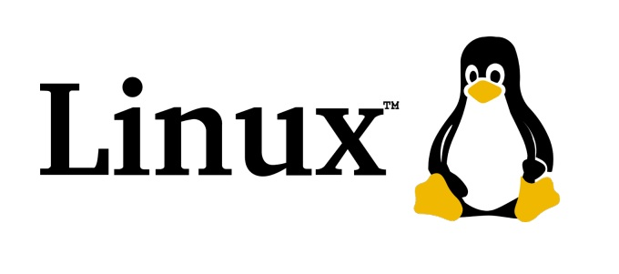

## Por que Linux?
- Seguro
- Estável
- Roda em qualquer lugar
- Grátis
- Suporte

 

 

## Distribuições Linux
Há muitas versões Linux disponíveis no Mercado, distribuições para uso pessoal com interfaces amigáveis como por exemplo o ubuntu que chamamos de **Desktop**.

E também encontramos distribuições enterprise que são utilizadas para **servidores**.

 

## Diferenças entre versões
### Servidor
- Navegação através do terminal
- Mais recurso alocado para execução de tarefas

### Desktop
- Similar ao Windows, possui interface gráfica

 

## Diferenças entre versões

- Uso Pessoal: Manjaro
- Uso Comercial: CentOS

