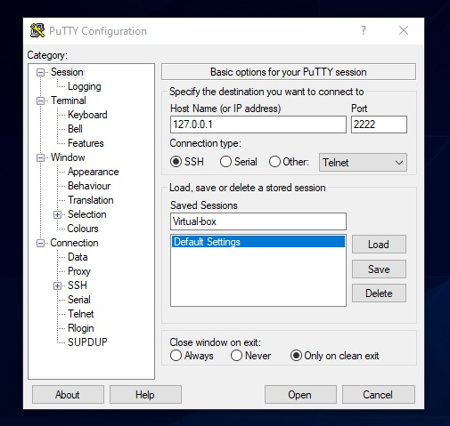
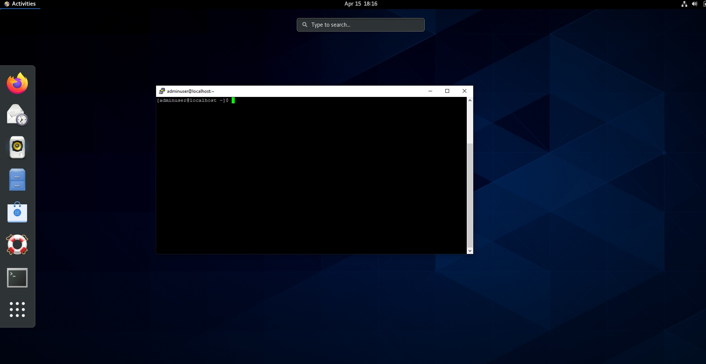
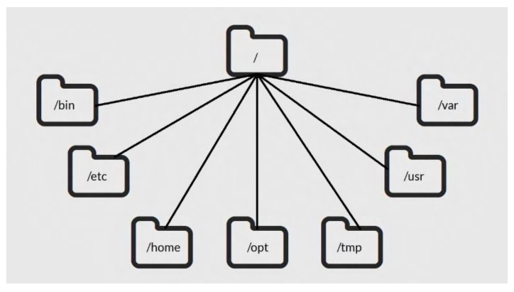

## 📌 Aula 2: Principais ferramentas e funções do Linux como ambiente de desenvolvimento (no Windows)

## SSH - Secure Shell Protocol
O SSH é um protocolo de rede para o usuário administrador acessar,
remotamente seus servidores.

A porta padrão é a 22 e o tipo de conexão é via TCP.

Link para baixar o Putty:
- https://www.chiark.greenend.org.uk/~sgtatham/putty/latest.html

Putty é um software que funciona como um terminal de simulação open source aplicado no estabelecimento de conexões seguras para o acesso remoto a servidores via SSH. Ele constrói “túneis” encriptados entre servidores e pode ser usado para gerir o seu servidor remotamente, instalar ou desinstalar aplicações ou simplesmente reiniciar o servidor. De forma geral, Putty nada mais é do que um terminal de simulação open source que foi desenvolvido para agir como um cliente de conexões seguras através de protocolos raw TCP, Telnet, rlogin e porta serial. Dessa maneira, o Putty foi desenvolvido para o uso, principalmente, por programadores e administradores de rede.

Configurando o putty



Após a configuração abra a sessão criada ``Virtual-box`` e faça o login com seu usuário e senha do linux.



<br>

## Principais diretórios Linux
- **/** “Root,” O topo da hierarquia das pastas
- **/bin** Arquivos binários
- **/etc** Arquivos de configuração do sistema
- **/home** Diretórios do seu home como Documentos, Downloads etc...
- **/opt** Arquivos opcionais, ou pastas para armazenar arquivos de aplicativos
- **/tmp** Pasta para uso temporário, geralmente deletada quando vc faz um reboot
- **/usr** Programas e arquivos do usuário que não são utilizados pelo sistema
- **/var** Pasta para armazenamento de dados, logs

<br>



## Comandos básicos Linux
- pwd -> onde estamos
- cd .. -> sobe um nível no diretório
- ls -> listar arquivos
- cd -> acessar algum diretório
- mkdir -> criar pastas
- touch -> criar arquivos
- ps aux -> processos rodando

<br>

## O comando Find

```
find [path...] [expression]

find /home -name hello-world.py
```

### O Comando Find -> Arquivos
- **name** pattern busca arquivos com o nome especificado:
```
find /home -name hello-world.py
```

- **iname** pattern igual ao -name, mas ignora letras maiusculas e 
minusculas
```
find /home -iname hello-world.py
```

- **ls** detalha informações de cada arquivo encontrado
```
find /home -name python -ls
```

<br>

### O Comando Find -> Diretórios
Para encontrar diretórios precisamos adicionar o **parâmetro -d**
```
find / -type d -name “apt” -ls
```

ou

```
find / -type d -iname “apt” -ls
```

Para ignorar diretorios com maiusculas e minusculas
