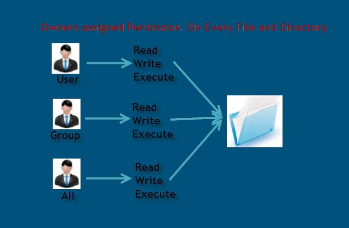
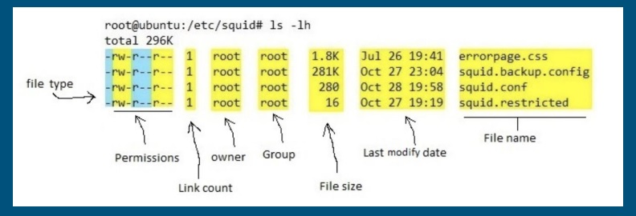
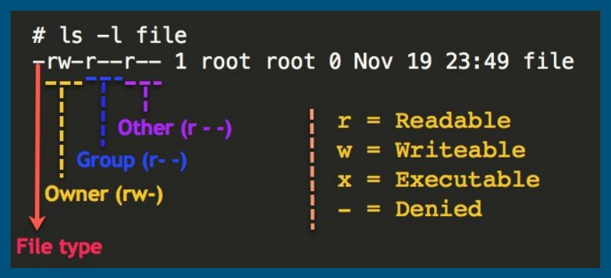

## 📌 Gerenciamento de arquivos de permissões

## Como Permissões funcionam em Linux



Em Linux cada arquivo e diretório possuem um dono, toda vez que criamos um arquivo automaticamente nosso usuário é atribuído como dono do arquivo ou  diretório, temos algumas classificações e níveis diferente de permissões em  Linux.

Podemos quebrar essas permissões em 3 partes nas quais veremos a seguir.

- Leitura -> READ
- Escrita -> Write
- Execução -> Run



Somente o sudo ou usuários administradores tem permissão para alterar privilégios de outros arquivos ou diretórios
```
sudo vim /etc/sudoers
```

> “execute” permite que usuários executem arquivos. E também acessem diretórios

### Categorias de Permissões
```
Symbol      Permission
u           User
g           Group
o           Other
a           All
```

<br>

### Grupos
- Usuários estão em pelo menos um grupo
- Usuários podem pertencer a mais de um grupo
- Grupos são usados para organizar usuários
- O comando groups <username> mostra os grupos do usuário
- Usuários administradores possuem o grupo wheel que tem permissão de acesso como root



<br>

### Adicionando Usuário em um Grupo
```
sudo usermod -a -G <nome-do-grupo> <nome-do-usuário>

sudo usermod -a -G finance-team adminuser
```

> OBS: para ativar grupos, é preciso que o usuário deslogue e logue novamente

<br>

### Mudando Permissões

```
Item        Descrição
chmod       comando base para mudar a permissão
ugoa        usuário, grupo, outros e all
+-=         adicionar, subtrair ou modificar permissão
rwx         Read, Write, Execute
```

```
sudo chmod <level da permissão><diretório>
sudo chmod g=w+r+x finance/
```

Para mudarmos a permissão para arquivos e subdiretórios, podemos adicionar o -R (recursivo) sudo chmod -R g=w+r+x finance/
