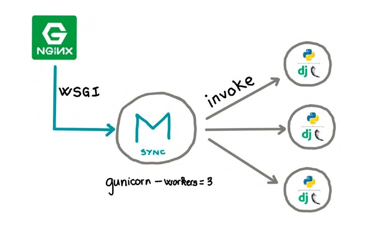

## 📌 Como o Gunicorn funciona e como configurar

## Como o Gunicorn funciona
Gunicorn é um servidor HTTP WSGI para UNIX escrito em Python. É um modelo de trabalhador pré-fork e é amplamente compatível com vários frameworks da web, simples de implementar, leve em recursos do servidor e bastante rápido .


O pré-fork worker trabalha da seguinte forma:
- O master cria os workers antes de tratar as requisições HTTP
- O master cria diversas instâncias da nossa aplicação e as mantém rodando, verifica se elas estão rodando sem erros além de distribuir as requisições nessas instâncias e verificar se há aquantidade exata de workers que configuramos inicialmente.



<br>

## Instalação do Gunicorn

Instalar o Python
```
sudo yum -y install python3

sudo yum -y install python3-pip
```

Adicionar o comando python como atalho para o comando Python3 (atalho)
```
sudo alternatives --set python /usr/bin/python3
```

Instalar o Gunicorn: https://docs.gunicorn.org/en/latest/install.html
```
sudo pip3 install gunicorn
```

<br>

## Configurações do Gunicorn

Link: https://docs.gunicorn.org/en/latest/configure.html