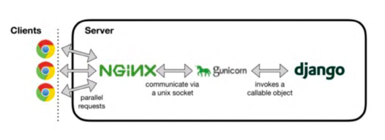

## 📌 O que é Nginx e como configurar o Nginx

## Introdução ao Nginx

O Nginx foi desenvolvido para oferecer baixo uso de memória e alta disponibilidade. 

Em vez de criarnovos processos para cada requisição da web, o Nginx usa uma abordagem assíncrona orientada a eventos, em que as solicitações são tratadas em uma única Thread.

O Nginx trabalha com a seguintes funcionalidades:
- Proxy Reverso
- IPv6
- Load balance
- FastCGI com Caching
- WebSockets
- Armazenamento de conteúdo estático, incluindo arquivos e auto indexação
- TLS/SSL com SNI


<br>

## Instalação do Nginx

1 - Instalar o Nginx
```
sudo yum –y install nginx

```

2 - Configurar Nginx para subir automáticamente quando nossa máquina ligar
```
sudo systemctl enable nginx
```

<br>

## Porque utilizar o Nginx e Gunicorn juntos?
O Nginx estará a frente do aplicativo ou site, cuidando do certificado de segurança, além de servir conteúdos estáticos como imagens, e layout do seu site ou aplicativo (CSS, Metadados), já o Gunicorn está próximo da sua aplicação tratando de requisições que não podem e não foram tratadas pelo Nginx como requisições de negócios que envolve o tratamento da sua aplicação.

