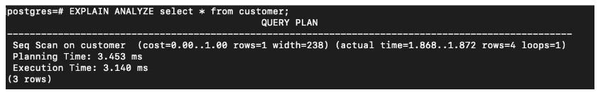
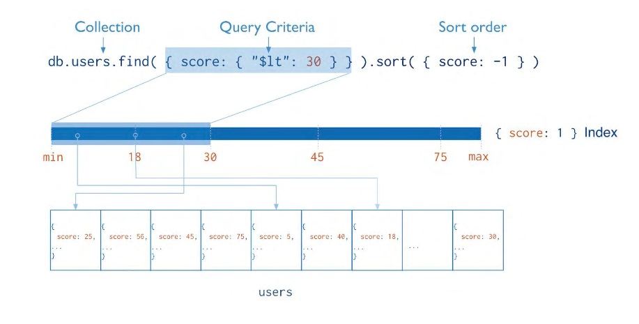

## 📌 Aula 03: Como indice pode diminuir o tempo de busca de dados em um banco e dados SQL 
### Como o SQL armazena os dados
Os registros são armazenados em páginas de dados, páginas estas que compõem o que chamamos de pilha, que por sua vez é uma coleção de páginas de dados que contém os registros de uma tabela.

 

Os registros de dados não são armazenados em uma ordem específica.

As páginas de dados não estão vinculadas a uma lista, pois implementam diretamente o conceito de pilhas.

Quando são inseridos registros em uma página de dados e ela se encontra quase cheia, as páginas de dados são divididas em um link é estabelecido para marcações e ligações entre elas.

 

### Utilizando o comando Explain
O Postgres possui uma funcionalidade bem útil quando precisamos verificar o tempo e o custo de um determinado SELECT, esse comando se chama EXPLAIN ANALYZE.

Com o EXPLAIN ANALYZE teremos o retorno detalhado da execução de um SELECT:

 

### Índices no SQL
Índices são sempre bem vindos em colunas de grande seletividade.

Índices são utilizados para facilitar a busca de informações em uma tabela com o menor número possível de operações de leituras, tornando assim a busca mais rápida e eficiente . Eles funcionam como uma lista telefônica, onde a mesma possui um índice por ordem alfabética do sobrenome dos “participantes”. Sabendo a letra inicial do sobrenome é possível refinar a pesquisa iniciando a mesma pela página correspondente a letra do sobrenome.

### Indices no NOSQL(Mongo, MariaDB…)

Índices em bancos de dados NoSQL, como o MongoDB, são utilizados para agilizar consultas. Eles funcionam como um mapa que associa valores de um campo com os documentos correspondentes. Ao fazer uma consulta que utiliza um índice, o MongoDB utiliza o mapa para localizar os documentos correspondentes e evitar a necessidade de percorrer todos os documentos da coleção.

O uso de índices pode trazer grandes melhorias para o desempenho do banco de dados. No entanto, é importante identificar os campos que são mais utilizados em consultas e criar índices apenas nesses campos.

