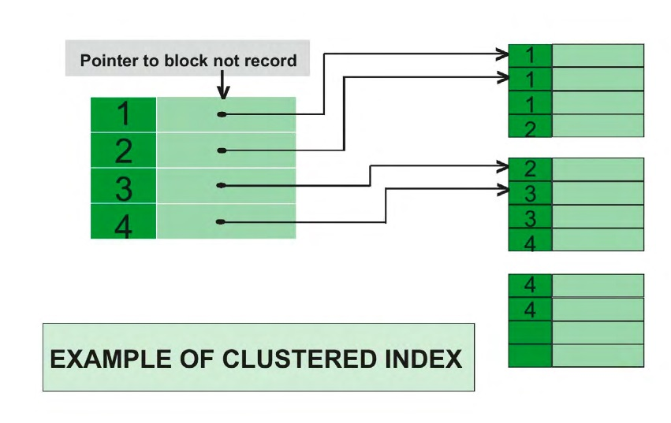

## 📌 Aula 03: Quais são os diferentes tipos de Índices 
### Índice Clusterizado
Um índice clusterizado determina a ordem em que as linhas de uma tabela são armazenadas no disco.

Suponha que temos uma tabela chamada “Livro” que tem uma coluna de chave primária “livroID” e que criamos um índice clusterizado para essa mesma coluna. Ao fazer isso, todas as linhas dentro da tabela Livro serão fisicamente ordenadas (Através de um Grupo).

Numa tabela, quando é definida uma chave primária (PK), um índice clusterizado é criado automaticamente pelo banco para a mesma. E o que ele faz basicamente é ordenar as informações pela coluna de chave daquele índice em disco.

Postgres não possuí suporte para índices clusterizados.



<br>

### Índice Não Clusterizado
O índice não clusterizado é semelhante ao índice de um livro.

O índice de um livro consiste em um nome de capítulo e número de página, se você quiser ler qualquer tópico ou capítulo, você pode ir diretamente para essa página usando o índice desse livro.

Não há necessidade de passar por cada página de um livro.
```
CLUSTER employees USING employees_ind;
```


<br>

### Vantagens
Os índices clusterizados classificam e armazenam as linhas de dados da tabela ou exibição com base em seus valores de chave. Pode haver apenas um índice clusterizado por tabela, pois as linhas de dados podem ser classificadas somente em uma única ordem. A principal vantagem dos índices clusterizados é a performance nas pesquisas: elas são mais rápidas em relação aos não-clusterizados.

Já os índices não clusterizados têm uma estrutura distinta das linhas de dados. O índice não clusterizado contém os valores de chave de índice não clusterizado e cada entrada de valor de chave tem um ponteiro para a linha de dados que contém o valor de chave.