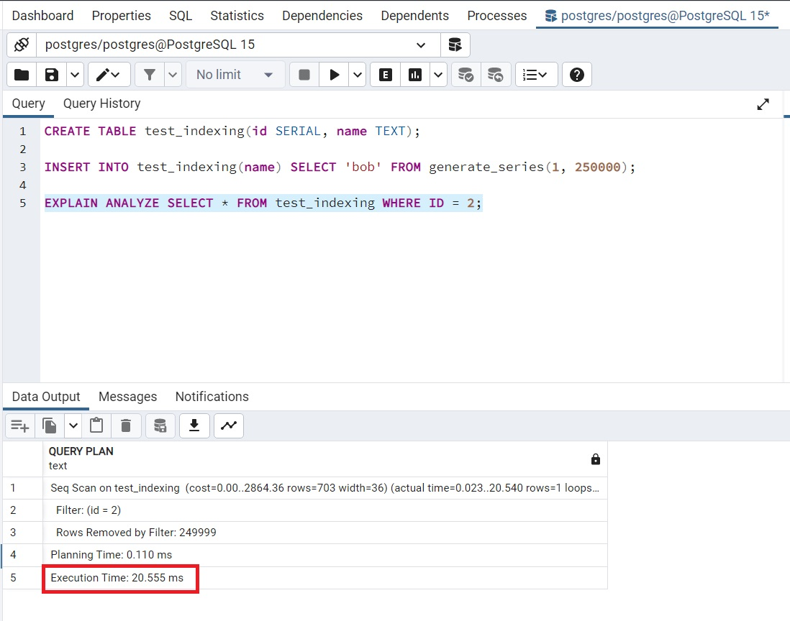
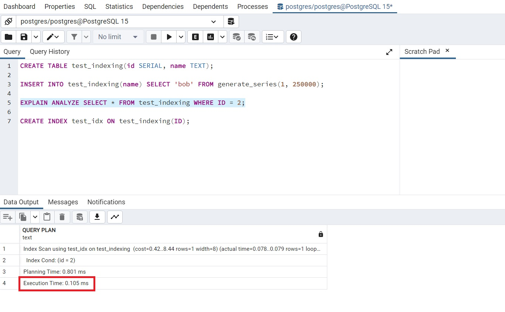

## 📌 Aula 04: Como criar índices no Postgres 
### B-tree e Sorting
As entradas do índice B-Tree são classificadas em ordem ascendente por padrão. Em alguns casos, faz sentido fornecer uma ordem de tipo diferente para um índice.

Para Criar um Índice B-Tree em uma Coluna Única
```
CREATE INDEX customer_name_index ON customer(name DESC NULLS LAST);
```

Para Criar um Índice B-Tree em diversas colunas
```
CREATE INDEX customer_name_email_index ON customer(name, email);
```

Exemplo:

Para este exemplo iremos utilizar o software pgAdmin e iremos criar uma tabela chamada ``test_indexing`` dentro do schema ``public``, após a criação iremos inserir alguns registros na tabela e iremos realizar uma consulta por ID:
```
CREATE TABLE test_indexing(id SERIAL, name TEXT);

INSERT INTO test_indexing(name) SELECT 'bob' FROM generate_series(1, 250000);

EXPLAIN ANALYZE SELECT * FROM test_indexing WHERE ID = 2;
```



Note que na imagem acima após realizarmos o comando o tempo de execução foi de 20.555ms

<br>

Agora iremos realizar a mesma consulta sendo que iremos criar um Índice e realizar a comsulta por este indice criado:
```
CREATE INDEX test_idx ON test_indexing(ID);

EXPLAIN ANALYZE SELECT * FROM test_indexing WHERE ID = 2;
```



Note que ao realizarmos a consulta utilizando nosso indice, o tempo de execução reduziu drasticamente para 0.105ms.

Em resumo ao criar um índice na coluna ID da tabela test_indexing, você está permitindo que o banco de dados possa localizar rapidamente as linhas que correspondem aos critérios da consulta. Sem o índice, o banco de dados teria que verificar cada linha da tabela para encontrar aquelas que correspondem à consulta, o que pode ser demorado se a tabela tiver muitas linhas.

Com o índice, o banco de dados pode usar uma estrutura de dados eficiente para localizar rapidamente as linhas que correspondem à consulta. Isso pode acelerar consideravelmente a execução da consulta, como observamos no exemplo.