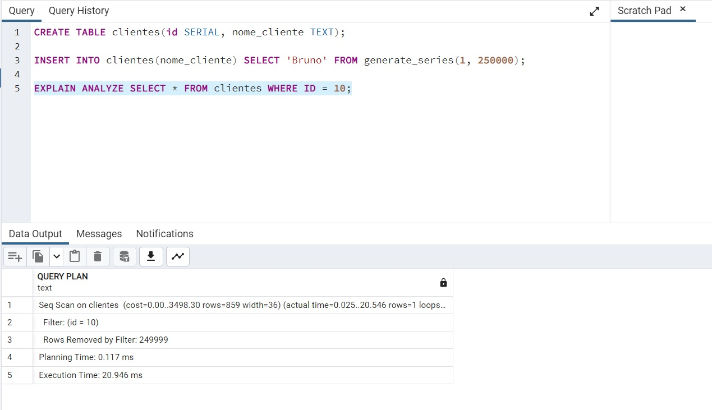
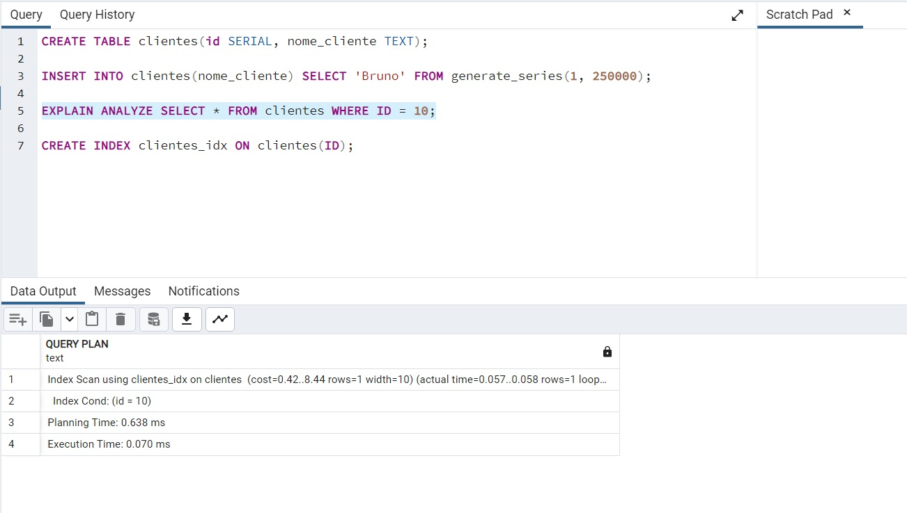

### 💻Exercicio
Agora você já sabe como índices funcionam e como otimizar buscas em bancos com grande volume de dados, neste exercício vamos executar um SELECT utilizando o analyze na tabela de clientes salvar o resultado, vamos criar um índice em um campo na tabela clientes e executar um novo SELECT e comparar o resultado.

Você pode compartilhar os arquivos de criação de indice na plataforma da EBAC. Entregar no formato .sql

<br>

### 💡 Solução 
Foi realizado a criação da entidade clientes, inserido dados e efetuado select na entidade, através do comando abaixo:
```
------------------ CRIANDO TABELA E REALIZANDO CONSULTA ------------------------

CREATE TABLE clientes(id SERIAL, nome_cliente TEXT);

INSERT INTO clientes(nome_cliente) SELECT 'Bruno' FROM generate_series(1, 250000);

EXPLAIN ANALYZE SELECT * FROM clientes WHERE ID = 10;
```

Resultado da primeira consulta:


Tempo de Execução: 20.946ms

<br>

Foi efetuada a criação do indice e efetuado nova consulta:
```
------------------------ CRIANDO INDICE E NOVA CONSULTA ------------------------

CREATE INDEX clientes_idx ON clientes(ID);

EXPLAIN ANALYZE SELECT * FROM clientes WHERE ID = 10;
```

Resultado da segunda consulta:


Tempo de Execução: 0.070ms