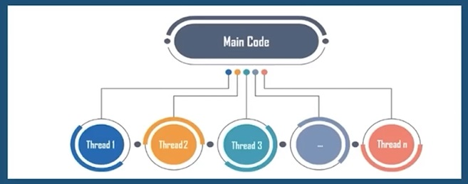
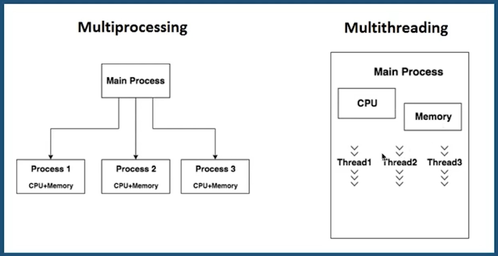

## 📝 Aula 05: Threads parte 2
### O que é Threads
Threads são fluxos de execução do sistema que permitem que um processo/tarefa de um programa de computador seja dividido em duas ou mais tarefas que podem ser executadas concorrentemente. Cada fluxo de execução do sistema, seja associado a um processo ou no interior do núcleo, é denominado thread.

Isso significa que um programa pode ter várias threads executando simultaneamente, cada uma realizando uma tarefa diferente. As threads podem compartilhar recursos do sistema, como memória e variáveis, e podem se comunicar entre si para coordenar suas ações.

Threads são úteis para melhorar o desempenho de programas ao permitir que várias tarefas sejam executadas simultaneamente. Eles também podem ser usados para melhorar a responsividade de programas ao permitir que tarefas demoradas sejam executadas em segundo plano enquanto o programa continua respondendo às ações do usuário.



<br>

#### Exemplo 01 - Thread
```
import threading

def new():
    for x in range(6):
        print('Single Thread')

t1 = threading.Thread(target=new)

t1.start()
t1.join()

print('Success')
```
Este é um exemplo simples de como criar e executar uma thread em Python usando o módulo threading. O código define uma função chamada new que imprime a string 'Single Thread' seis vezes.

Em seguida, o código cria um objeto Thread chamado t1 e passa a função new como o alvo da thread. Isso significa que quando a thread for iniciada, ela executará a função new.

O método start() é usado para iniciar a thread e o método join() é usado para esperar até que a thread termine antes de continuar. Depois que a thread termina, o código imprime a string 'Success'.

A saída deste código deve ser:
```
Single Thread
Single Thread
Single Thread
Single Thread
Single Thread
Single Thread
Success
```

<br>

### O que é Multithreads
Multithreading é a capacidade de um sistema operacional de executar várias threads simultaneamente sem que uma interfira na outra. As threads compartilham os recursos do processo, mas são capazes de ser executadas de forma independente.

Isso significa que um programa pode ter várias threads executando simultaneamente, cada uma realizando uma tarefa diferente. As threads podem compartilhar recursos do sistema, como memória e variáveis, e podem se comunicar entre si para coordenar suas ações.

Multithreading é útil para melhorar o desempenho de programas ao permitir que várias tarefas sejam executadas simultaneamente. Ele também pode ser usado para melhorar a responsividade de programas ao permitir que tarefas demoradas sejam executadas em segundo plano enquanto o programa continua respondendo às ações do usuário.

<br>

#### Exemplo 02 - Multithread
```
import time
import threading

def calc_square(numbers):
    print('Calculate square numbers: ')
    for i in numbers:
        #time-delay
        time.sleep(2)
        print('square: {} '.format(str(i * i)))

def calc_cube(numbers):
    print('Calculate cube numbers: ')
    for i in numbers:
        time.sleep(2)
        print('cube: {} '.format(str(i * i * i)))

if __name__ == '__main__':
    arr = [2, 3, 8, 9]
    t1 = threading.Thread(target=calc_square, args=(arr,))
    t2 = threading.Thread(target=calc_cube, args=(arr,))
    # creating two threads here t1 & t2
    t1.start()
    t2.start()
    # starting threads here parallel by using start function.
    t1.join()
    # this join() will wait until the cal_square() function is finished
    t2.join()
    # this join() will wait until the cal_cube() function is finished
    print('Main Thread Here!!')
    print('Successes!')
```

Este é um exemplo de como criar e executar duas threads em Python usando o módulo threading. O código define duas funções, calc_square e calc_cube, que calculam o quadrado e o cubo de uma lista de números, respectivamente. Cada função imprime o resultado de cada cálculo com um atraso de 2 segundos entre cada cálculo.

Em seguida, o código cria dois objetos Thread, t1 e t2, e passa as funções calc_square e calc_cube como os alvos das threads, respectivamente. Isso significa que quando as threads forem iniciadas, elas executarão as funções calc_square e calc_cube, respectivamente.

Os métodos start() são usados para iniciar as threads e os métodos join() são usados para esperar até que ambas as threads terminem antes de continuar. Depois que as threads terminam, o código imprime a string 'Main Thread Here!!' seguida pela string 'Successes!'.

A saída deste código deve ser algo como:
```
Calculate square numbers: 
Calculate cube numbers: 
square: 4 
cube: 8 
square: 9 
cube: 27 
square: 64 
cube: 512 
square: 81 
cube: 729 
Main Thread Here!!
Successes!
```

> Observe que a ordem exata das linhas pode variar devido à natureza não determinística da execução de threads.

<br>

### Multi Processing e GIL
O Global Interpreter Lock (GIL) é um mecanismo de segurança implementado no interpretador CPython que permite que apenas uma thread execute código Python por vez. Isso significa que, mesmo em um ambiente multithreaded com mais de um núcleo de CPU, apenas uma thread pode estar em um estado de execução a qualquer momento.

Para contornar essa limitação e permitir que o código Python seja executado em paralelo em vários núcleos de CPU, é possível usar a biblioteca multiprocessing do Python. Essa biblioteca permite que você crie vários processos, cada um com seu próprio interpretador Python e, portanto, seu próprio GIL.

Isso significa que cada processo pode executar código Python simultaneamente em um núcleo de CPU diferente, permitindo que o programa aproveite ao máximo a capacidade de processamento da CPU. No entanto, como cada processo tem seu próprio espaço de memória, é necessário usar mecanismos de comunicação interprocessos para compartilhar dados entre os processos.

A biblioteca multiprocessing do Python permite que você crie vários processos e execute código em paralelo em vários núcleos de CPU. Isso é útil para contornar a limitação do Global Interpreter Lock (GIL), que permite que apenas uma thread execute código Python por vez.

Para usar a biblioteca multiprocessing, você pode criar um objeto Process para cada processo que deseja criar e, em seguida, chamar o método start() para iniciar o processo. O objeto Process segue a API do módulo threading.Thread, então se você já está familiarizado com o uso de threads em Python, a transição para o uso de processos deve ser bastante simples.



<br>

#### Exemplo 03 - Multiprocessing
```
import multiprocessing

# Creating a global variable
results = []

def calc_square(numbers):
    global results
    for i in numbers:
        print('square: ', str(i * i))
        results.append(i * i)
        print('Within a result: ' + str(results))

if __name__ == '__main__':
    arr = [2, 3, 8, 9]
    p1 = multiprocessing.Process(target=calc_square, args=(arr,))
    # creating one Process here p1
    p1.start()
    # starting Processes here parallel by using start function.
    p1.join()
    # this join() will wait until the cal_square() function is finished
    print('result: ' + str(results))
    # this print didn't work here we have to print it within the process
    print('Successes!')
```
Este é um exemplo de como criar e executar um processo em Python usando o módulo multiprocessing. O código define uma função chamada calc_square que calcula o quadrado de uma lista de números e armazena os resultados em uma variável global chamada results.

Em seguida, o código cria um objeto Process chamado p1 e passa a função calc_square como o alvo do processo. Isso significa que quando o processo for iniciado, ele executará a função calc_square.

O método start() é usado para iniciar o processo e o método join() é usado para esperar até que o processo termine antes de continuar. Depois que o processo termina, o código tenta imprimir o conteúdo da variável global results, mas isso não funciona porque a variável global results no processo filho é diferente da variável global results no processo principal.

A saída deste código deve ser algo como:

```
square:  4
Within a result: [4]
square:  9
Within a result: [4, 9]
square:  64
Within a result: [4, 9, 64]
square:  81
Within a result: [4, 9, 64, 81]
result: []
Successes!
```

> Observe que a variável global results é atualizada corretamente dentro do processo filho, mas não é atualizada no processo principal.


