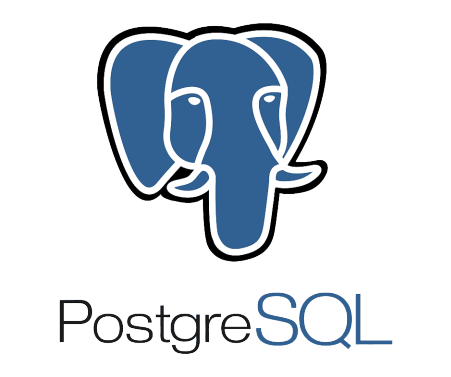

# 📌 Curso Back-End Python EBAC
Este repositório trata-se dos conteúdos do curso de desenvolvimento full-stack python da EBAC, referente ao conteúdo de Back-end

## 📝 Módulo 01: Configurando seu ambiente SQL
### 📎 Sumário
- Introdução a SQL;
- O que é um banco de dados;
- Quais são as diferenças entre os bancos de dados mais populares;
- O que é o Postgres;
- Como instalar o Postgres e como instalar a interface visual PGClient;
- Como instalar DBeaver como alternativa para interface visual;
- Como utilizar o DBeaver ou PGClient;
- Como planejar e desenhar tabelas utilizando o lucidchart;

 

### ✅ Introdução a SQL
SQL é a linguagem mais conhecida por DBAs e programadores para executar comandos em bancos de dados relacionais. É por meio dela que criamos tabelas, colunas, índices, atribuímos permissões a usuários e realizamos consultas a dados. Em resumo, é utilizando a SQL que “conversamos” com o banco de dados.

 

### ✅ O que é um banco de dados
Um banco de dados é uma coleção organizada de informações - ou dados - estruturadas, normalmente armazenadas eletronicamente em um sistema de computador. Um banco de dados é geralmente controlado por um sistema de gerenciamento de banco de dados (DBMS).

Existem vários tipos de bancos de dados que atendem a diferentes propósitos. Alguns dos principais tipos de bancos de dados incluem Oracle, SQL Server, MySQL, PostgreSQL, MongoDB e NoSQL

 

### ✅ Quais são as diferenças entre os bancos de dados mais populares

| Gratuitos(Open Source) | Pagos |
| --- | --- |
| MySQL | SQL Server |
| Postgres | Oracle |

### Suporte Oracle x Postgres
| Postgres | Oracle |
| --- | --- |
| Suporte da Comunidade em fóruns e github | Empresas licenciadas oferecem suporte pago |

### Segurança Oracle x Postgres
| Postgres | Oracle |
| --- | --- |
| Seguro, porém requer um conhecimento especializado para manutenção e segurança | Seguro e requer um alto custo para funcionalidades extras para proteção do nosso banco de dados |

 

### ✅ O que é o Postgres
PostgreSQL é um sistema de gerenciamento de banco de dados do tipo objeto-relacional (ORDBMS) com ênfase em extensibilidade e em padrões de conformidade. Ele está disponível em praticamente qualquer variante do Unix e Windows e tem suporte a várias linguagens de programação. Além disso, ele tem uma comunidade ativa que auxilia no desenvolvimento de novas funcionalidades e implementações de segurança dentro do banco de dados.

 

 

- Gratuito
- Banco de dados relacional
- Suporte para SQL (relacional) e JSON (não relacional)
- Utilizado para Aplicações WEB e Mobile

 

Link: https://www.postgresql.org/

### ✅ 