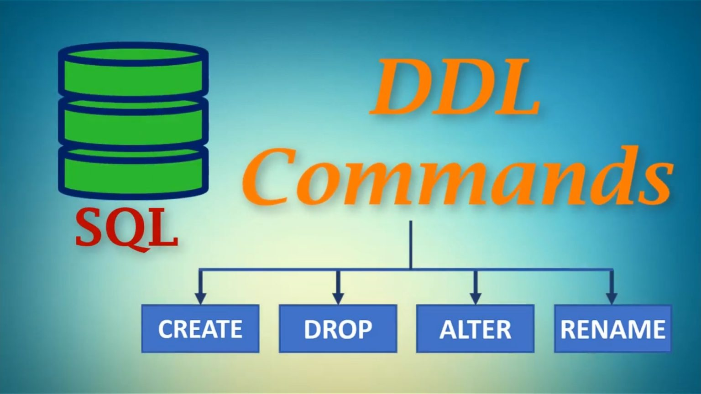

# 📝 Módulo 02 - Definindo a estrutura de um banco de dados(DDL)
## ✅ Oque A sigla DDL representa em SQL
DDL é a sigla para Data Definition Language que em português significa Linguagem de Definição de Dados. É um subconjunto dos comandos da linguagem SQL cujo propósito é definir a estrutura de um banco de dados. Assim, esses comandos são empregados para criar, alterar e excluir objetos do banco, como tabelas, colunas e até mesmo o banco de dados em si.

Os comandos DDL incluem CREATE, ALTER, DROP e TRUNCATE.

Por exemplo, o comando CREATE permite criar um objeto no banco, como uma nova tabela, visão, índice ou outro elemento estrutural. A sintaxe para criar um banco de dados ou uma tabela pode variar dependendo do sistema de gerenciamento de banco de dados (SGBD) utilizado.

