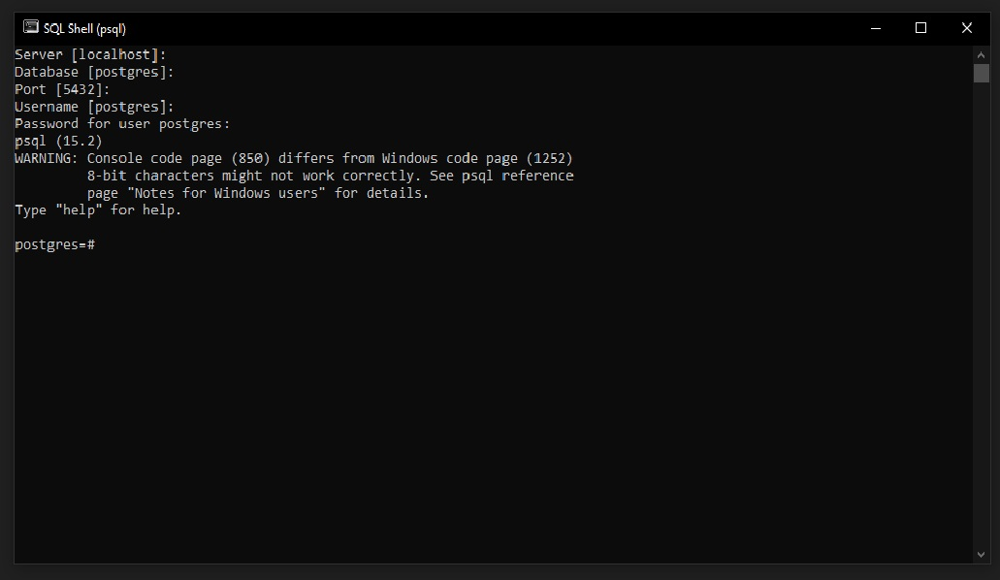
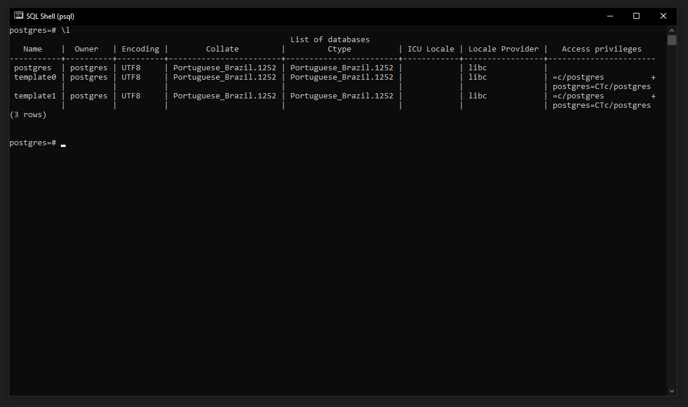
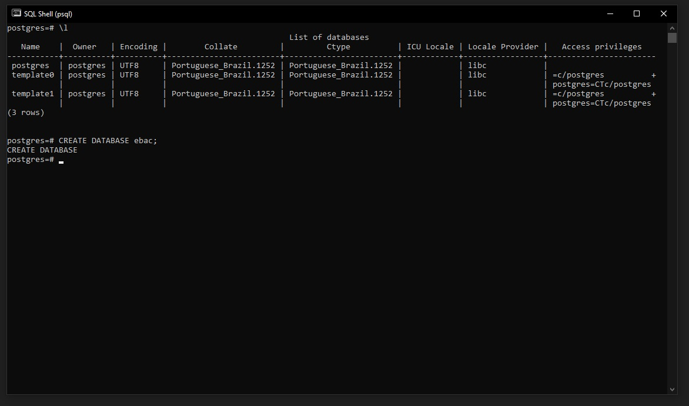
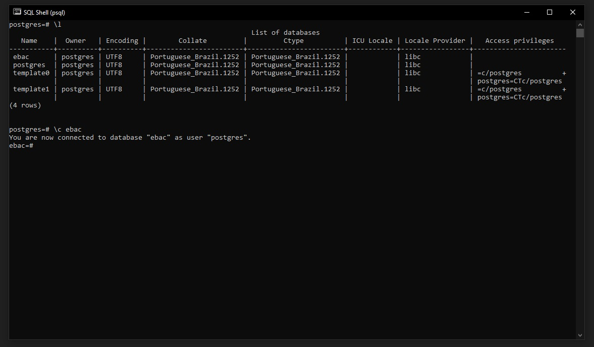
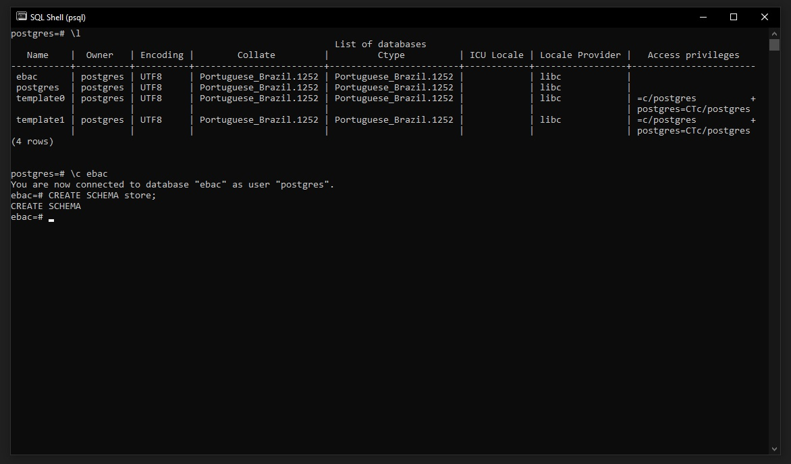

## ✅ Criando esquemas e base de dados utilizando a linha de comando
Na Base de Dados definimos toda a nossa estrutura de dados do mais alto nível
até o mais baixo:

Base de Dados > Schema > Tabelas

Para criar uma base de dados basta apenas executar o comando:
```
CREATE DATABASE <nome do database>
```

<br>

Schemas são espaços onde adicionamos e organizamos tabelas, funções e entre outros objetos de banco de dados.

A sintaxe para criação de um schema é:
```
CREATE SCHEMA <nome do schema>
```

OU

```
CREATE SCHEMA IF NOT EXISTS <nome do schema>
```

**OBS:** A cláusula IF NOT EXISTS é usada para verificar se o esquema especificado já existe. Se o esquema já existir, o comando não fará nenhuma alteração e retornará uma mensagem informando que o esquema já existe, em vez de terminar com um erro. Essa cláusula é útil ao escrever scripts, para que o script não falhe se o comando CREATE SCHEMA tentar criar um esquema que já existe.

Sem a cláusula IF NOT EXISTS, se você tentar criar um esquema que já existe, o comando retornará um erro.

<br>

Exemplo criado no PGadmin:

> Foi criada o database chamado ebac e o schema chamado store

Para a criação de database e schema no software PGadmin é relativamente mais simples e basta utilizar o botão direito do mouse em cima de database ou schema e utilizar a opção ``CREATE``

<br>

### Comandos no SQL Shell(psql)
Para acessar o postgres via o terminal sql shell, é necessário inserir suas senha do postgress.


<br>

Para listar todos os bancos de dados disponívis utilize o comando:
```
\l
```



<br>

Para criar uma database via terminal SQL Shell, digite o comando:
```
CREATE DATABASE ebac;
```
> Note que iremos criar um database com o nome de ``ebac``



<br>

Após criarmos o database ebac, vamos acessar esse database por meio do comando:
```
\c ebac
```



Após acessar nossa database, vamos criar o schema com o comando abaixo:
```
CREATE SCHEMA store;
```

