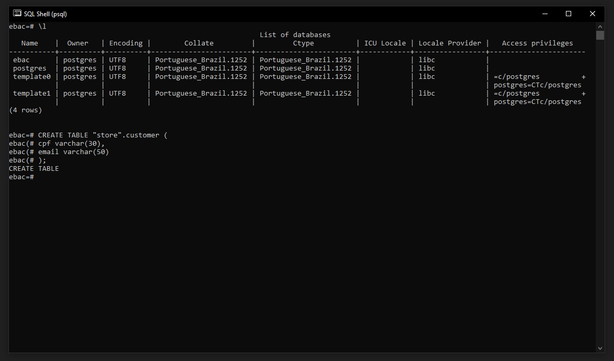
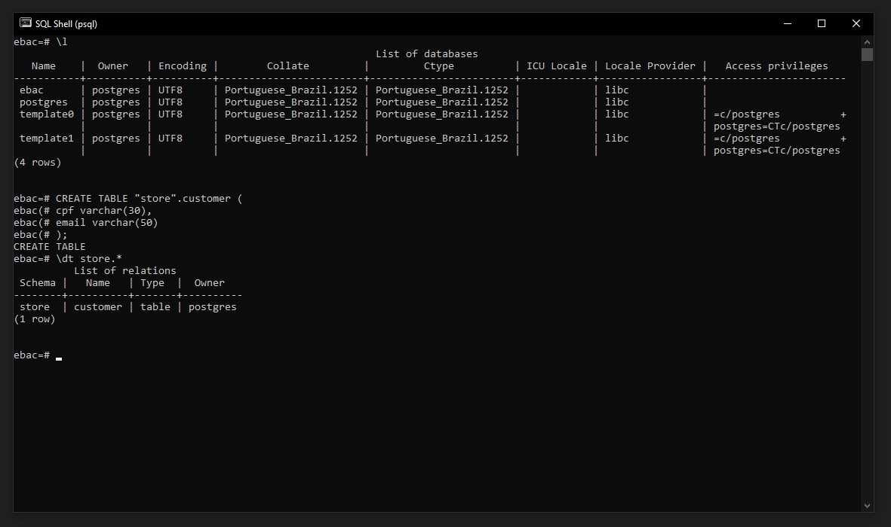
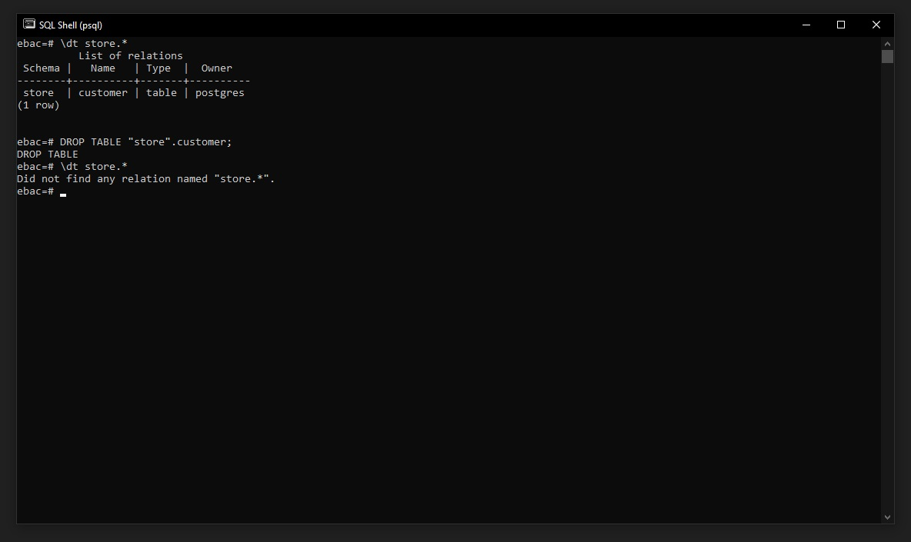
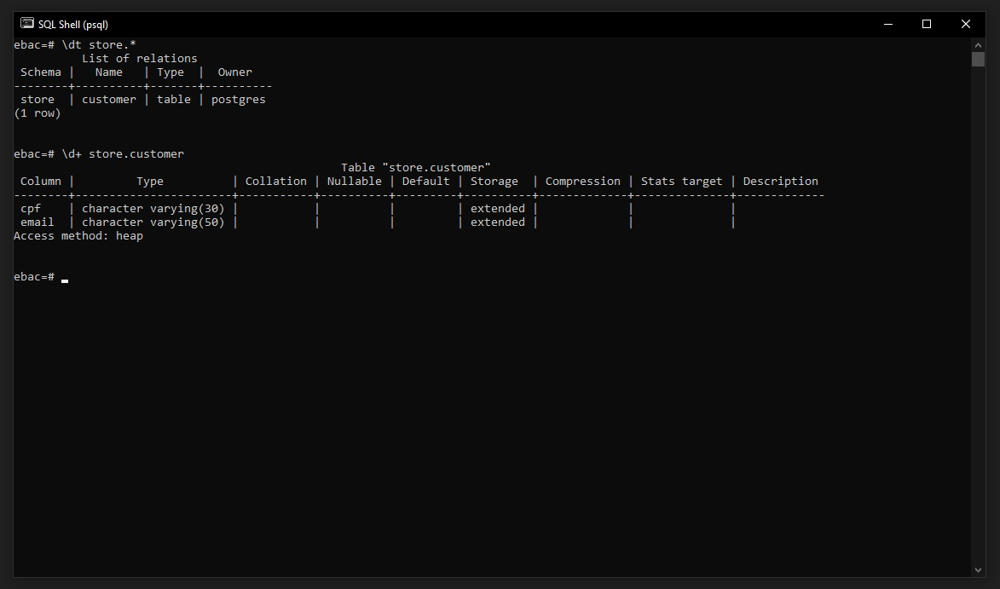
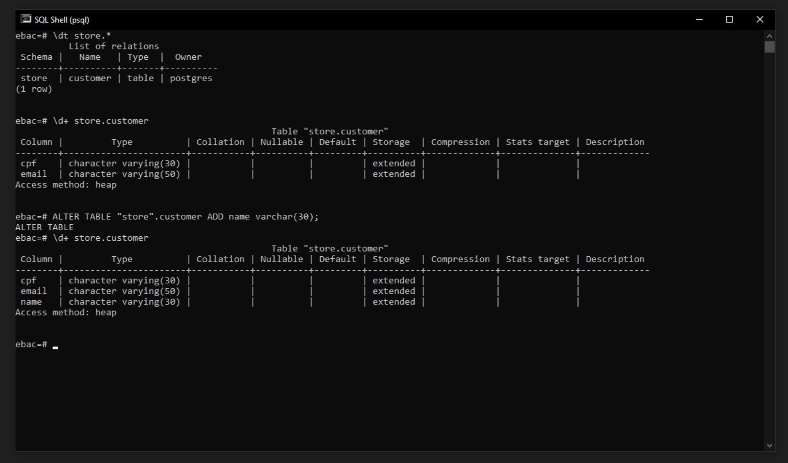
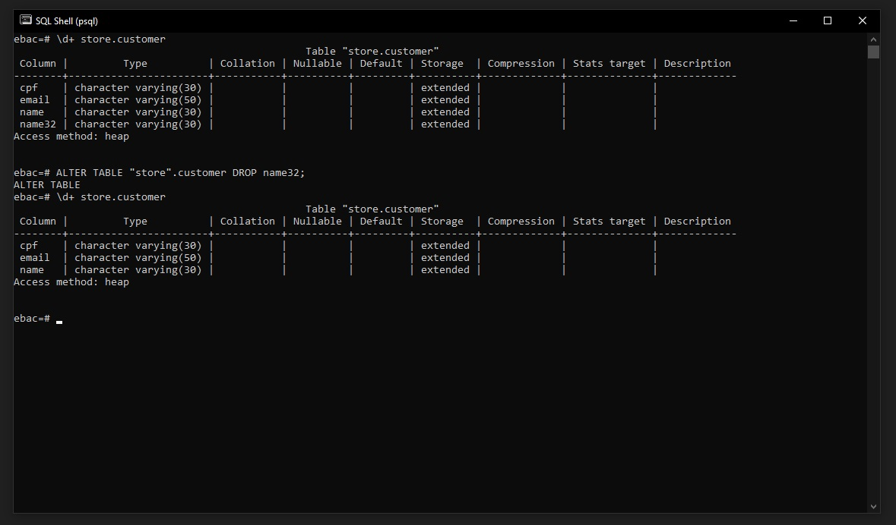

## ✅ Criando Tabelas e Colunas utilizando a linha de comando

### 1.1 Criando Tabelas
Para criar Tabelas e Colunas no SQL precisamos utilizar o comando CREATE TABLE seguido das informações de Colunas:
```
CREATE TABLE nome_da_tabela(
    coluna1 datatype,
    coluna2 datatype,
    coluna3 datatype,
    ....
    colunaN datatype,
    PRIMARY KEY(uma ou mais colunas)
)
```

<br>

Vamos criar uma tabela(entidade) chamada ``customer`` com o comando abaixo:

```
CREATE TABLE "store".customer(
    cpf varchar(30),
    email varchar(50)
);
```



<br>

> **Nota 01:** Note que para criar uma entidade, dentro de um schema especifico é necessário identificar o schema pela notação ``"nome_schema"`` e após isso utilizar o ponto e o nome da entidade. ``"nome_schema".nome_entidade``

> **Nota 02:** Quando criamos uma tabela no terminal, podemos dar enter sem o comando terminar, que ele conmtinuara a criação até definirmos ``;`` no fim do comando, assim podemos deixar o comando mais legivel, conforme imagem acima.

<br>

### 1.2 Visualizando as tabelas dentro do Schema
Para verificar as tabelas dentro do schema, utilizamos o comando:
```
\dt store.*
```
> Note que a notação de ``*`` é referente a todas as tabelas, se quisermos checar uma tabela especifica, trocamos pelo nome da tabela. Ex: ``\dt store.customer``



> Nota 01: É importante ressaltar que se não informamos qual o schema iremos criar a tabela, a mesma será criada dentro schema ``public``

<br>

### 1.3 Deletando uma tabela dentro do Schema
Para realizar o comando de deletar uma tabela, utilizamos:
```
DROP TABLE "store".customer;
```



<br>

### 1.4 Visualizando informações da tabela
Para visualizar as informações de colunas e etc dentro da tabela utilizamos o comando:
```
\d+ store.customer
```
> Note que utilizamos como exemplo a tabela criada dentro do nosso schema store.



<br>

### 1.5 Adicionando Colunas
Para adicionar Colunas em tabelas existentes no SQL precisamos utilizar o comando ALTER TABLE seguido das informações da coluna que queremos adicionar.
```
ALTER TABLE <Nome da Tabela> ADD <nome da coluna><tipo do campo>
```

Como exemplo iremos criar a coluna nome em customer.
```
ALTER TABLE "store".customer ADD name varchar(30);
```



<br>

### 1.6 Remover Colunas
Para remover Colunas em tabelas existentes no SQL precisamos utilizar o comando ALTER TABLE seguido das informações da coluna que queremos remover.
```
ALTER TABLE <Nome da Tabela> DROP <nome da coluna>;
```

Como exemplo criei a coluna nome32 em customer e iremos deletar ela com o comando abaixo.

```
ALTER TABLE "store".customer DROP nome32;
```

