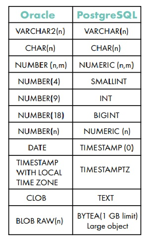
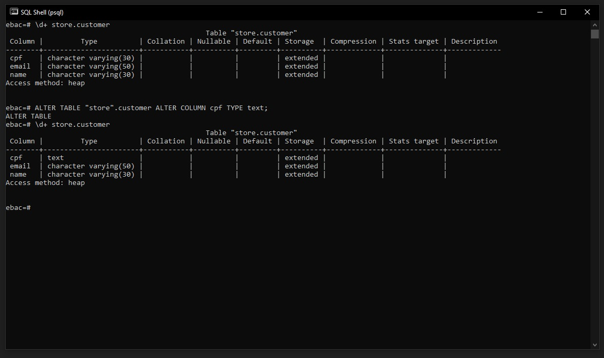
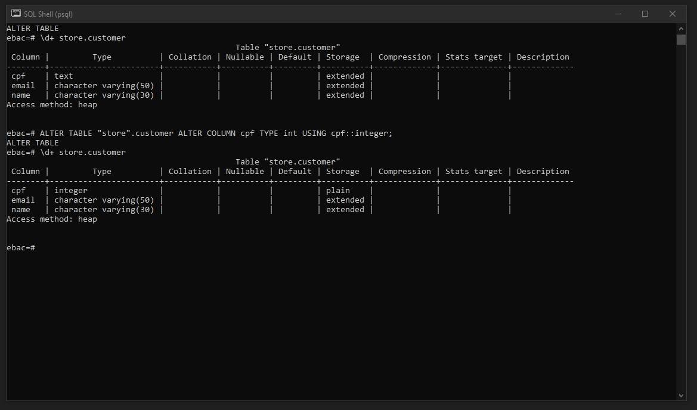
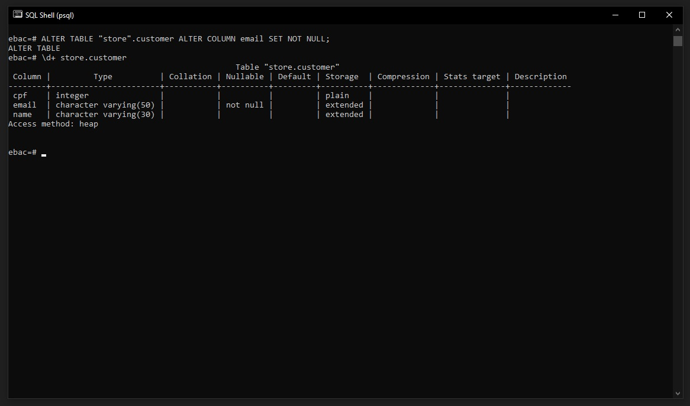
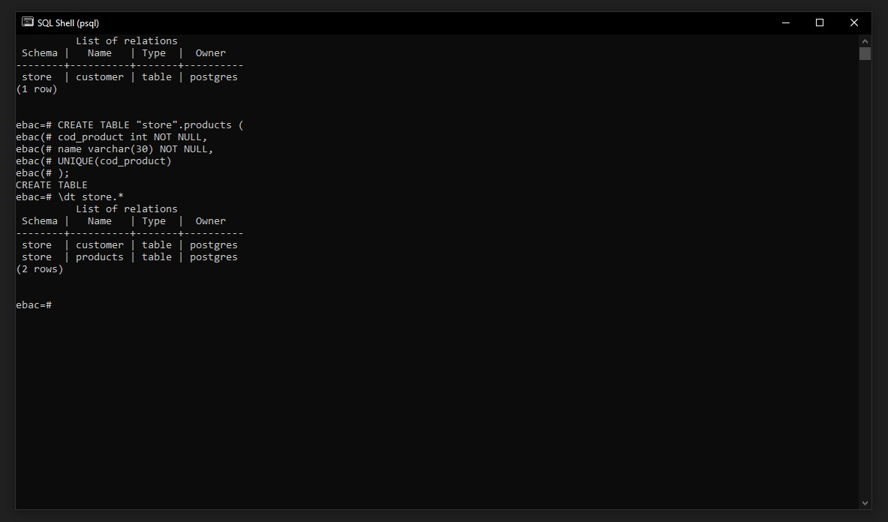
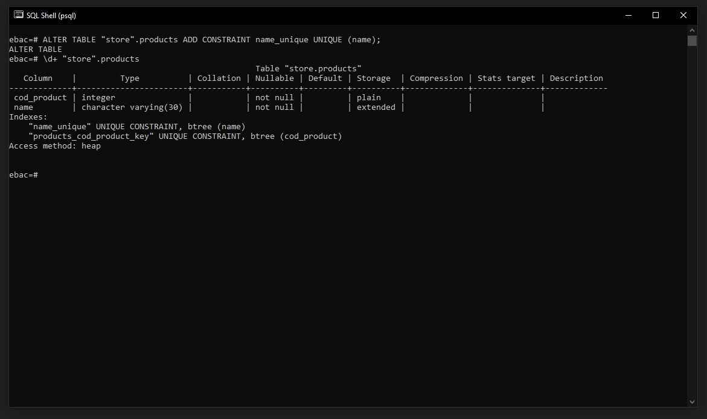

## ✅ Como definir tipos de dados para armazenar informações e como proteger seus dados utilizando constraints

### 1.1 Tipos de dados em Colunas
Tipos de dados foram criados para proteger as informações dos dados da nossa tabela.



<br>

### 1.2 Alterando tipos de dados de uma tabela
Para alterar o tipo de dado a ser inserido em colunas de uma determinada tabela utilizamos o comando abaixo:
```
ALTER TABLE <nome da tabela> ALTER COLUMN <nome da coluna> TYPE <novo tipo de dado>;
```

Vamos usar um exemplo em nossa tabela ``customer``
```
ALTER TABLE "store".customer ALTER COLUMN cpf TYPE text;
```



<br>

Caso o tipo do campo seja diferente do tipo que queremos criar (exemplo texto para número)
temos que adicionar um asset_no para o postgres fazer a conversão do tipo:
```
ALTER TABLE "store".customer ALTER COLUMN cpf TYPE int USING cpf::integer;
```



<br>

### 1.3 Constraints
Constraints foram criados para proteger e prevenir dados incompletos entrarem na nossa base além de dados repetidos mantendo dados únicos dentro da nossa base.

### Constraints Not Null
Para não aceitar valores Nulos na nossa base podemos utilizar o ``NOT NULL``, exemplo como se fossemos criar uma tabela nova:
```
CREATE TABLE "store".customer (
    name varchar(30),
    cpf int,
    email varchar(50) NOT NULL
)
```

Para adicionar constraints Not Null em tabelas existentes:
```
ALTER TABLE "store".customer ALTER COLUMN email SET NOT NULL;
```



<br>


### Constraints Unique
Para não aceitar valores Repetidos na nossa base podemos utilizar o UNIQUE:

Como exemplo iremos criar uma nova tabela chamada ``products``, já inserindo o código UNIQUE.
```
CREATE TABLE "store".products ( 
    cod_product int NOT NULL,
    name varchar(30) NOT NULL,
    price numeric NOT NULL,
    UNIQUE (cod_product)
);

```



Para adicionar constraints Unique em tabelas existentes:
```
ALTER TABLE "store".products ADD CONSTRAINT name_unique UNIQUE (name);
```

