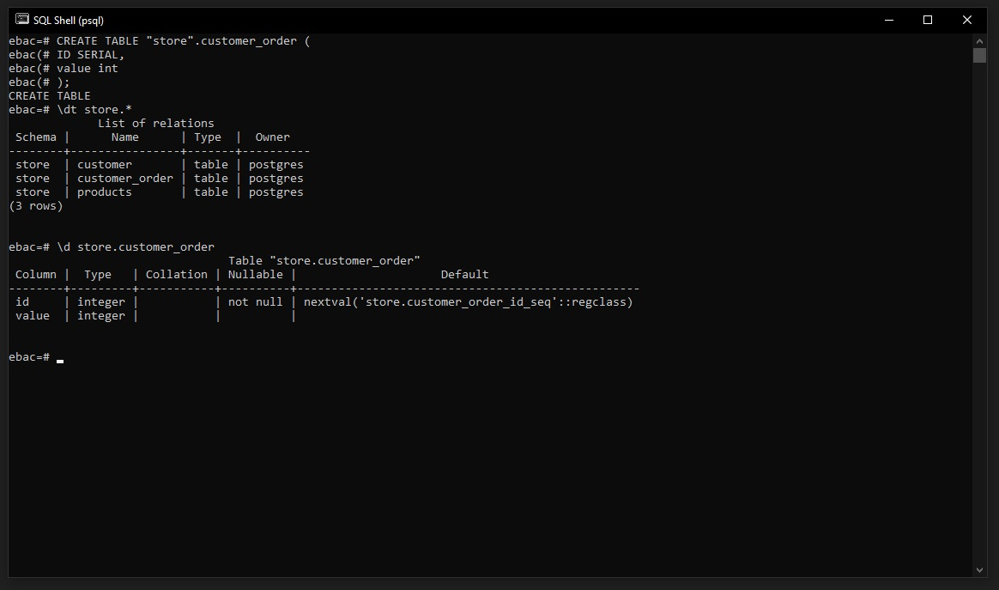

## ✅ Definino colunas com identificação automática
### 1.1 Valores Automáticos
Podemos usar o ``serial`` do Postgres para criar tabelas com números de id automáticos, geralmente usamos a coluna ID para receber esses valores automáticos:

```
CREATE TABLE company (
    id SERIAL PRIMARY KEY,
    name text NOT NULL,
    age int NOT NULL,
    address char(50),
    salary real
)
```

Para esse exemplo vamos criar a tabela ``customer_order``:
```
CREATE TABLE "store".customer_order (
    id SERIAL,
    value int
);
```



<br>

