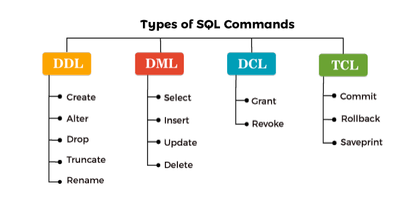

## ✅ O que a Sigla DML representa em SQL
DML é a sigla para Data Manipulation Language ou Linguagem de Manipulação de Dados em português. Ela lida com a manipulação de dados e inclui comandos SQL comuns como SELECT, INSERT, UPDATE e DELETE. Esses comandos são usados para armazenar, modificar, recuperar, excluir e atualizar dados em um banco de dados

DML Representa o grupo de manipulação dos dados no nosso banco de dados.