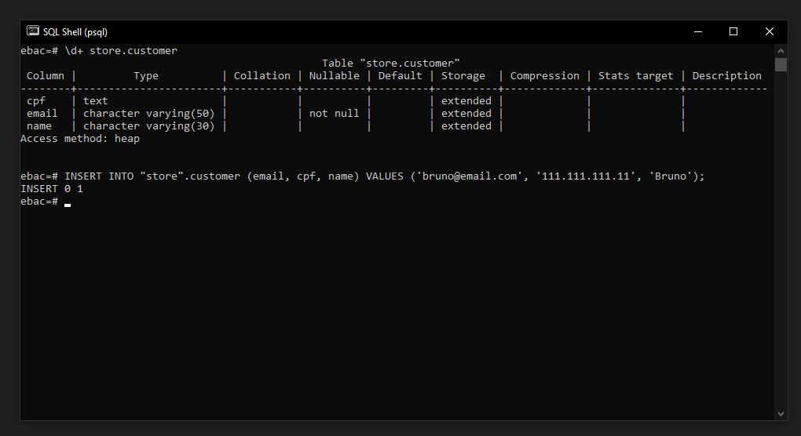
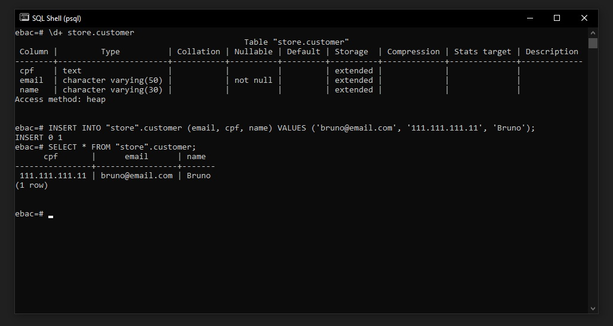
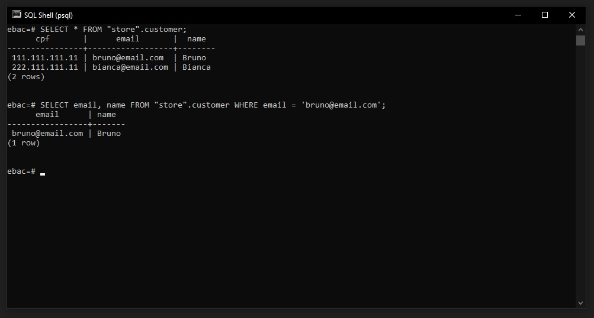

## ✅ Inserir, Buscar e Filtrar dados utilizando a linha de comando

### Inserir Dados
Para inserir dados em SQL utilizamos o comando INSERT.

Precisamos informar quais são os campos que vamos inserir dados:
```
INSERT INTO <nome da tabela> (colunas) VALUES (dados);
```
Para esse exemplo iremos inserir os dados na tabela customer:
```
INSERT INTO "store".customer (email, cpf, name) VALUES ('bruno@email.com', '111.111.111.11', 'Bruno');
```



<br>

### Buscar Dados
Para buscar dados em SQL podemos buscar por dados utilizando o comando SELECT.

Para mostrar todos os campos em uma tabela, utilizamos o *
```
SELECT * FROM <nome da tabela>;
```
Vamos utilizar o comando abaixo para buscar os dados que inserimos em nossa tabela customer:
```
SELECT * FROM "store".customer;
```



Podemos também retornar campos especificos como o exemplo abaixo:
```
# Retorno somente a coluna email
SELECT email FROM "store".customer;

ou

# Retorno a coluna email e nome
SELECT email, name FROM "store".customer;
```

<br>

### Filtrando Dados
Para buscar dados e adicionar filtros usamos o where informando o que vamos filtrar:
```
SELECT nome, email FROM <nome-da-tabela> WHERE <nome-do-campo> = '<nome do dado que queremos buscar ou filtrar>';
```

vamos utilizar o exemplo abaixo para o filtro:
> Note que foi inserido mais um dado na tabela, conforme imagem abaixo.
```
SELECT email, name FROM "store".customer WHERE email = 'bruno@email.com';
```

