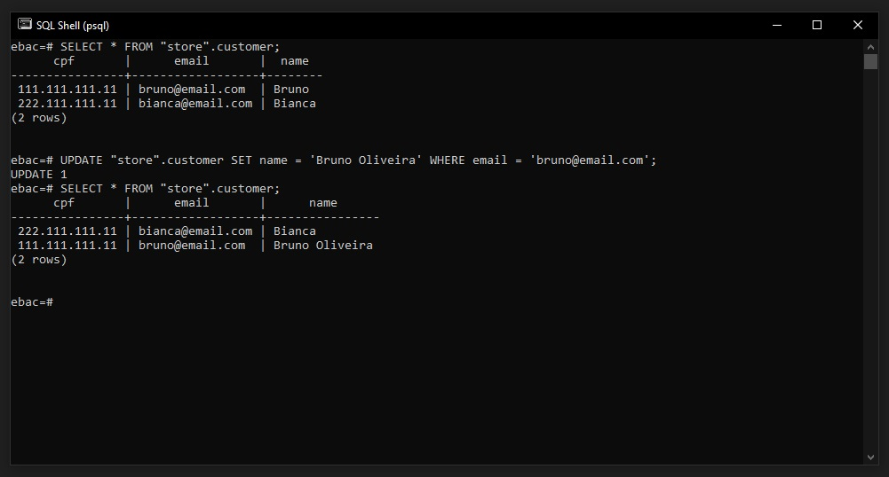
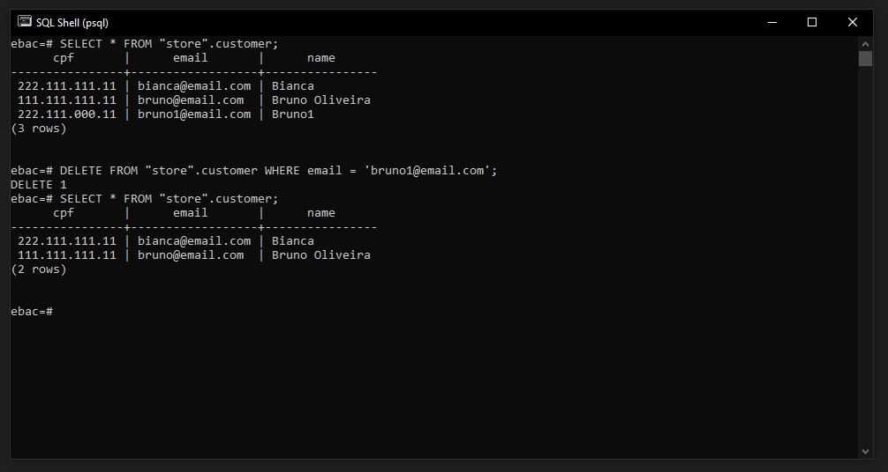

## ✅ Atualizar e Deletar dados utilizando a linha de comando
### Atualizando Dados
Para atualizar dados em SQL utilizamos o comando UPDATE.

Precisamos informar qual é o dado que vamos atualizar:
```
UPDATE <nome-da-tabela> SET <nome-da-coluna> = <novo valor> WHERE <identificação-do-dado-que-vamos-atualizar>;
```

Para esse exemplo utilizaremos o comando abaixo na tabela customer:
```
UPDATE "store".customer SET name = 'Bruno Oliveira' WHERE email = 'bruno@email.com';
```



<br>

### Deletando Dados
Para remover dados em SQL utilizamos o comando DELETE.

Precisamos informar qual é o dado que vamos remover:
```
DELETE FROM <nome-da-tabela> WHERE <nome-da-coluna> = <valor a ser deletado> WHERE <identificação-do-dado-que-vamos-atualizar>;
```

Para esse exemplo utilizaremos o comando abaixo na tabela customer, note que inserimos um terceiro campo e iremos deletar ele:
```
DELETE FROM "store".customer WHERE email = 'bruno1@email.com';
```

