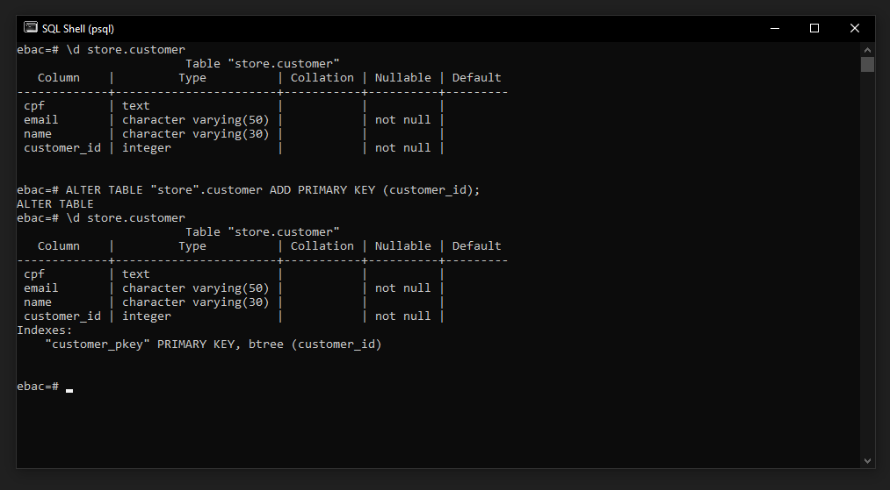
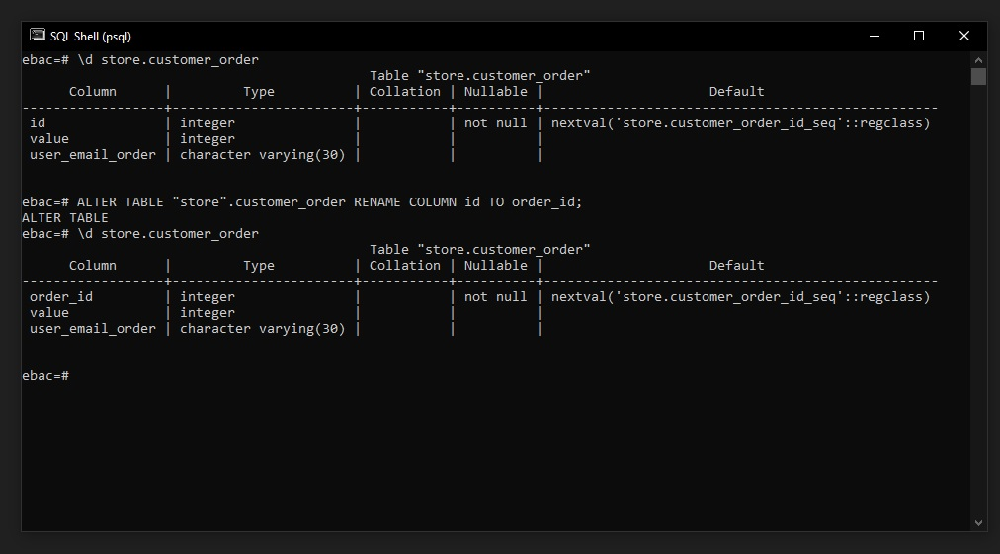
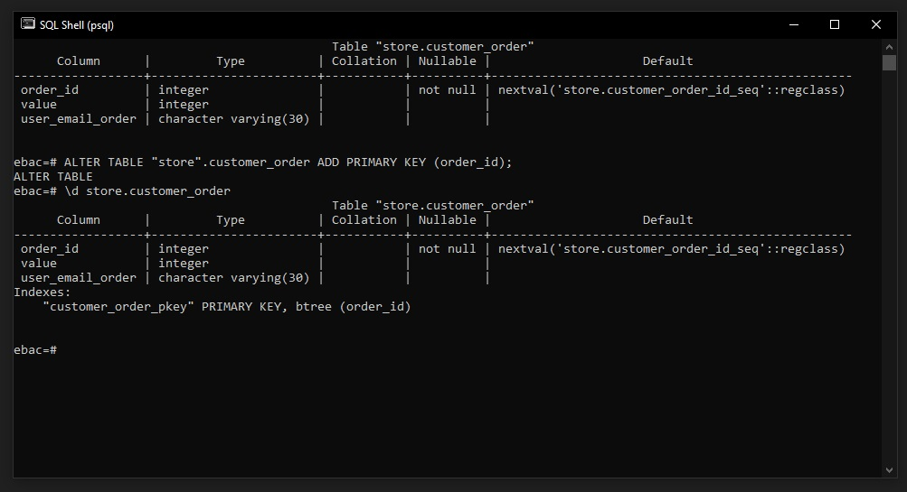
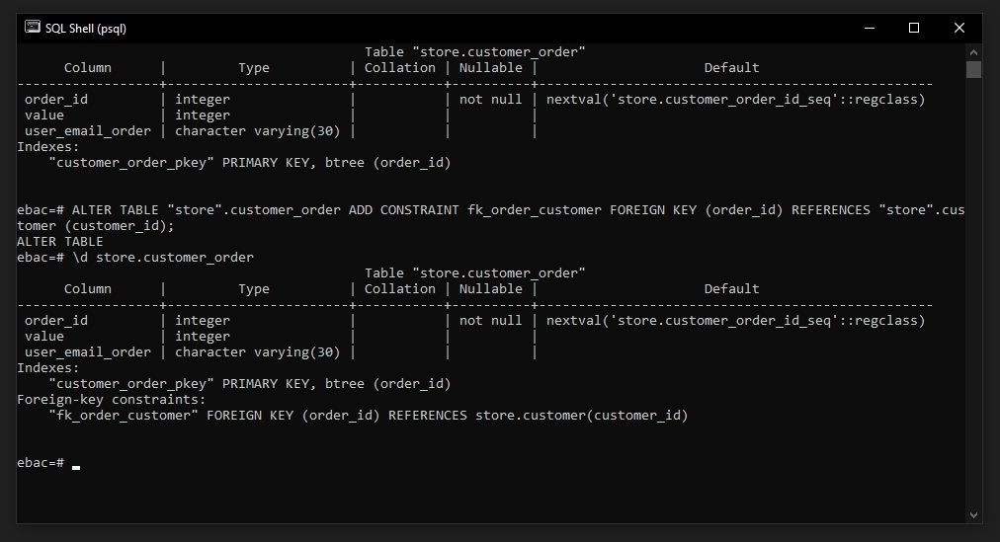
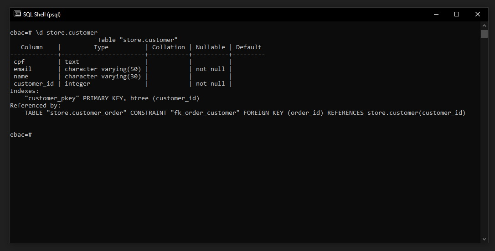

## ✅ Chaves Primárias e Chaves Compostas entre Tabelas
### Criando Tabelas com Chaves Primárias
```
CREATE TABLE order (
    id INTEGER PRIMARY KEY,
    value INTEGER,
);

```

### Adicionando Chaves Primárias em Tabelas Existentes
```
ALTER TABLE table_name ADD PRIMARY KEY (column_1, column_2);
```

<br>

Exemplo:

Primeiro iremos criar uma nova coluna chamada customer_id

> Note que a tabela pode conter dados, então é necessário limpar os dados antes através do comando ``DELETE FROM "store".customer``

```
ALTER TABLE "store".customer ADD customer_id INTEGER NOT NULL;
```

<br>

Para Criar uma chave primary iremos executar o comando abaixo para nossa coluna customer_order:
```
ALTER TABLE "store".customer ADD PRIMARY KEY (customer_id);
```



<br>

Agora iremos alterar o nome da coluna ``id`` em customer_order para ``order_id``:
```
ALTER TABLE "store".customer_order RENAME COLUMN id TO order_id;
```



Após alterar o nome, vamos atribuir a Primary key para order_id:
```
ALTER TABLE "store".customer_order ADD PRIMARY KEY (order_id);
```



<br>

### Criando relação entre tabelas

para criar o relacionamento entre as tabelas customer e customer_order, criamos a chave estrangeira com o comando abaixo:
```
ALTER TABLE "store".customer_order ADD CONSTRAINT fk_order_customer FOREIGN KEY (order_id) REFERENCES "store".customer (customer_id);
```



