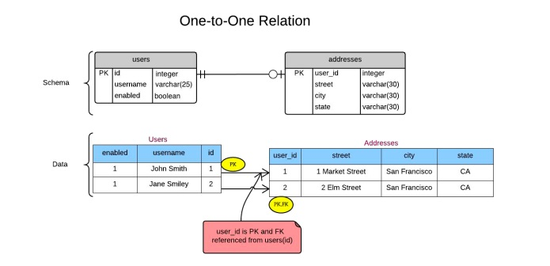
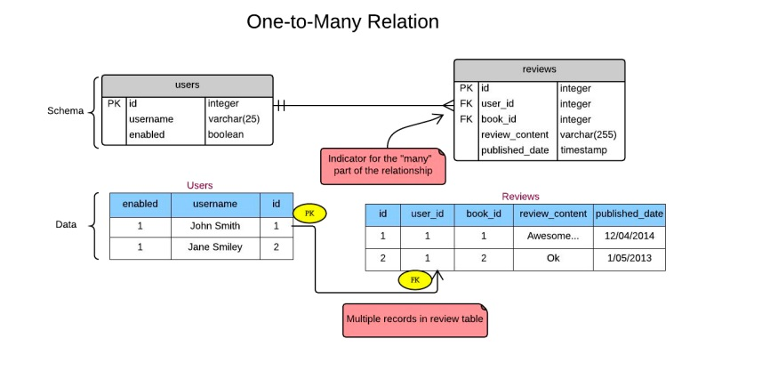
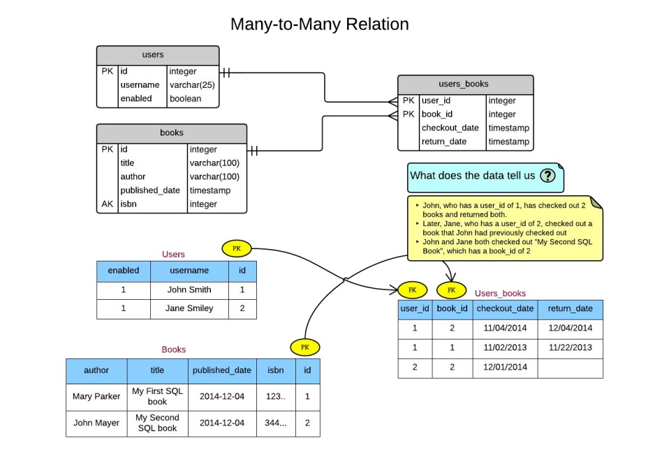

## ✅ Como criar relacionamento entre tabelas
```
CREATE TABLE customer (
    id INTEGER PRIMARY KEY,
    value INTEGER,
);
```
```
CREATE TABLE contact (
    id INTEGER PRIMARY KEY,
    customer_id INTEGER REFERENCES customer(id)
);
```

### Adicionando Relacionamento (FK) entre tabelas
```
ALTER TABLE table_name ADD CONSTRAINT <nome-da-constraint> FOREIGN KEY (column_1) REFERENCES customer (ID);

ALTER TABLE customer_order ADD CONSTRAINT fk_order_customer FOREIGN KEY (id) REFERENCES customer (email);
```

### Tipos de Relacionamento entre tabelas - 1:1 um para um



<br>

```
CREATE TABLE users (
    id serial,
    username VARCHAR(25) NOT NULL,
    enabled boolean DEFAULT TRUE,
    last_login timestamp NOT NULL
DEFAULT NOW(),
    PRIMARY KEY (id)
);
```
```
CREATE TABLE addresses (
    user_id int NOT NULL,
    street VARCHAR(30) NOT NULL,
    city VARCHAR(30) NOT NULL,
    state VARCHAR(30) NOT NULL,
    PRIMARY KEY (user_id),
    CONSTRAINT fk_user_id FOREIGN KEY
    (user_id) REFERENCES users (id)
);
```

<br>

### Tipos de Relacionamento entre tabelas - 1:N ou 1 para muitos



<br>

```
CREATE TABLE books (
    id serial,
    title VARCHAR(100) NOT NULL,
    author VARCHAR(100) NOT NULL,
    published_date timestamp NOT NULL,
    isbn int,
    PRIMARY KEY (id),
    UNIQUE (isbn)
);
```
```
DROP TABLE IF EXISTS reviews;
CREATE TABLE reviews (
    id serial,
    book_id int NOT NULL,
    user_id int NOT NULL,
    review_content VARCHAR(255),
    rating int,
    published_date timestamp DEFAULT
CURRENT_TIMESTAMP,
    PRIMARY KEY (id),
    FOREIGN KEY (book_id) REFERENCES
    books(id) ON DELETE CASCADE,
    FOREIGN KEY (user_id) REFERENCES
    users(id) ON DELETE CASCADE
);

```

<br>

### Tipos de Relacionamento entre tabelas - 1:N ou N para muitos



<br>

```
CREATE TABLE users_books (
    user_id int NOT NULL,
    book_id int NOT NULL,
    checkout_date timestamp,
    return_date timestamp,
    PRIMARY KEY (user_id, book_id),
    FOREIGN KEY (user_id) REFERENCES users(id) ON UPDATE CASCADE,
    FOREIGN KEY (book_id) REFERENCES books(id) ON UPDATE CASCADE
);
```
