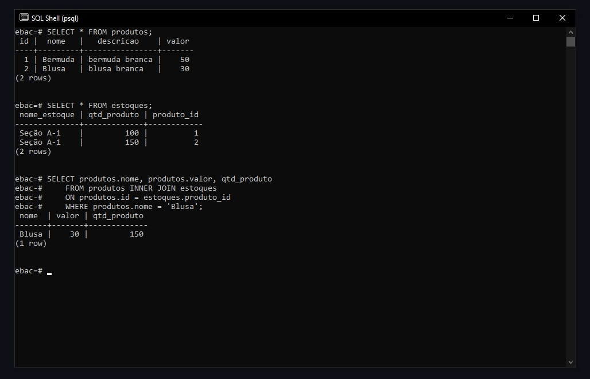

## ✅ Filtrando dados com inner join
Podemos utilizar o comando abaixo como exemplo para realizar uma consulta personalizada.
```
SELECT produtos.nome, produtos.valor, qtd_produto
    FROM produtos INNER JOIN estoques
    ON produtos.id = estoques.produto_id
    WHERE produtos.nome = 'Blusa';
```

