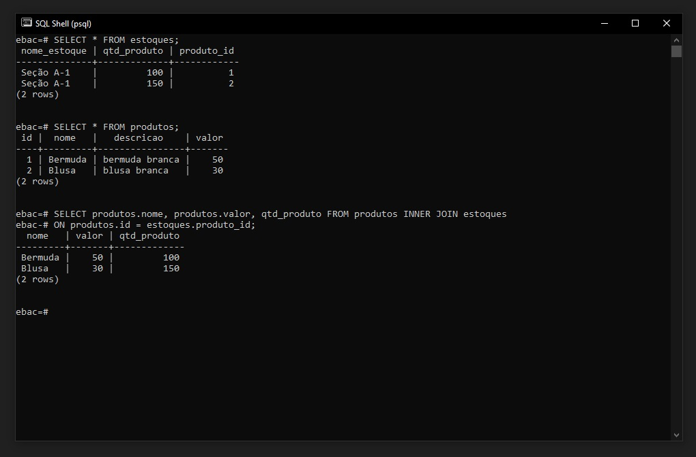

## Exercício
Nesse exercício, vamos criar a tabela de produto e estoque adicionando um relacionamento entre elas.

script de criação

### Criando Tabela produtos
```
CREATE TABLE produtos(
    id SERIAL UNIQUE PRIMARY KEY,
    nome varchar(30) NOT NULL,
    descricao varchar(100) NOT NULL,
    valor numeric NOT NULL
);
```

Criando Tabela estoques
```
CREATE TABLE estoques(
    nome_estoque varchar(30) NOT NULL,
    qtd_produto int,
    produto_id INTEGER REFERENCES produtos(id)
);
```
### Inserindo Dados
```
INSERT INTO produtos(
    nome, descricao, valor)
    VALUES ('Bermuda', 'bermuda branca', 50);

INSERT INTO produtos(
    nome, descricao, valor)
    VALUES ('Blusa', 'blusa branca', 30);

INSERT INTO estoques(
    nome_estoque, qtd_produto, produto_id)
    VALUES ('Seção A-1', 100, 1);

INSERT INTO estoques(
    nome_estoque, qtd_produto, produto_id)
    VALUES ('Seção A-1', 150, 2);
```
### Realizando consulta com INNER JOIN
```
SELECT produtos.nome, produtos.valor, qtd_produto
    FROM produtos INNER JOIN estoques
    ON produtos.id = estoques.produto_id;
```

<br>

RESULTADO FINAL:
