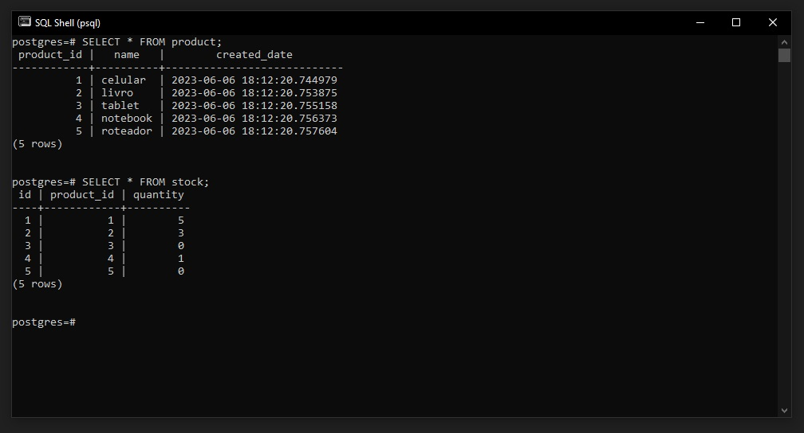
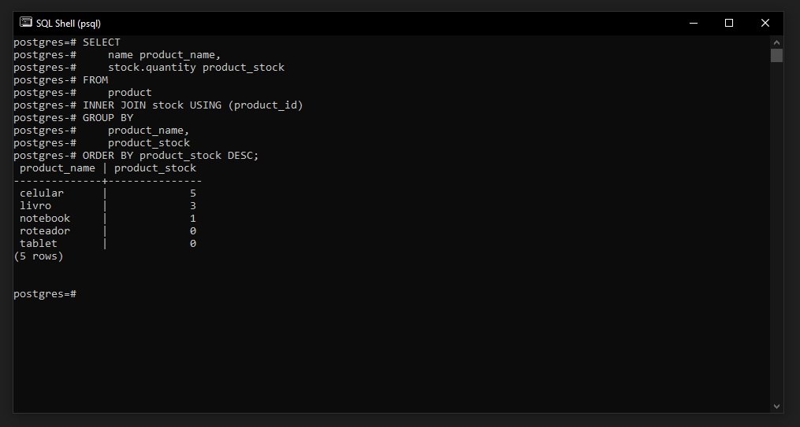
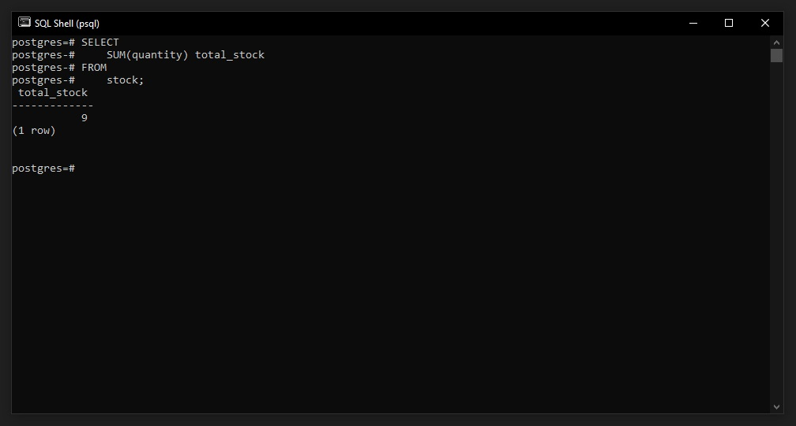

## 💻 Exercicio
Agora que você ja sabe como agregações funcionam neste exercício vamos construir uma agregação para saber a quantidade de itens que cada produto tem, você pode compartilhar os arquivos .SQL de agregação na plataforma da EBAC.

- Utilize a funçao de Group By e Sum, juntamente com o Join nas tabelas de Product e Stock

<br>

### 💡 Solução
Primeiramente foi criada as tabelas ``product`` e ``stock`` dentro do schema public com o comando abaixo:
```
--product
CREATE TABLE product (
    product_id serial NOT NULL,
    "name" varchar(25) NOT NULL,
    created_date timestamp NOT NULL DEFAULT now(),
    CONSTRAINT product_pkey PRIMARY KEY (product_id)
);

--stock
CREATE TABLE stock (
    id serial NOT NULL,
    product_id int4 NOT NULL,
    quantity int4 NOT NULL,
    CONSTRAINT stock_pkey PRIMARY KEY(id)
);
```

Após a criação das tabelas, foi inserido itens através do comando:
```
--1
INSERT INTO product (name) values ('celular');
INSERT INTO product (name) values ('livro');
INSERT INTO product (name) values ('tablet');
INSERT INTO product (name) values ('notebook');
INSERT INTO product (name) values ('roteador');

INSERT INTO stock (product_id, quantity) values (1, 5);
INSERT INTO stock (product_id, quantity) values (2, 3);
INSERT INTO stock (product_id, quantity) values (3, 0);
INSERT INTO stock (product_id, quantity) values (4, 1);
INSERT INTO stock (product_id, quantity) values (5, 0);
```

Resultado:


<br>

Foi utilizado o seguinte comando para, uma consulta SELECT que recupera informações das tabelas product e stock. A consulta usa um INNER JOIN para combinar as linhas das duas tabelas com base na coluna product_id. A cláusula GROUP BY agrupa as linhas resultantes por product_name e product_stock. A cláusula ORDER BY ordena os resultados em ordem decrescente de product_stock.

```
SELECT
    name product_name,
    stock.quantity product_stock
FROM
    product
INNER JOIN stock USING (product_id)
GROUP BY
    product_name,
    product_stock
ORDER BY product_stock DESC;
```

Resultado:


<br>

Foi realizado o comando abaixo para uma consulta SELECT que recupera informações da tabela stock. A consulta usa a função de agregação SUM para calcular a soma da coluna quantity de todas as linhas da tabela stock. O resultado final da consulta será uma única linha com uma única coluna chamada total_stock, que conterá a soma total de todas as quantidades em estoque.
```
SELECT
    SUM(quantity) total_stock
FROM
    stock;
```

Resultado:
